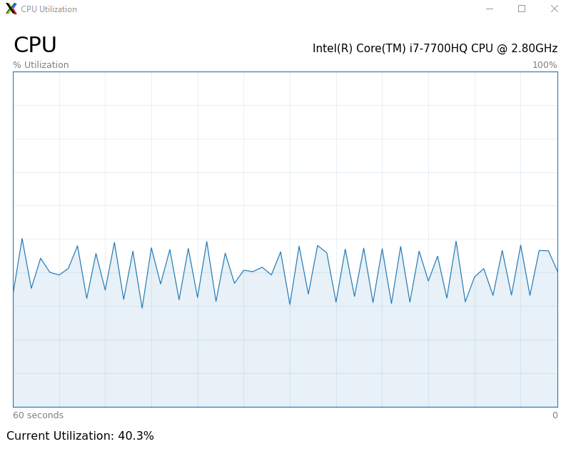

# CPU Utilization App in PyQt5
**Author**: Mohammad Arabzadeh  
**Email**: a.mohamad7824@gmail.com  

## Description
Monitor the CPU utilization using this simple PyQt app.
  


## Linux Instructions
1. Upgrade `pip` to the latest version and install `virtualenv`:
```
python3 -m pip install --user --upgrade pip
python3 -m pip install --user virtualenv
```
2. Go to the project's directory and make a new virtual environment:
```
python3 -m venv env
```
3. Activate the virtual environment:
```
source env/bin/activate
```
4. Install the necessary packages listed in the `requirements.txt` file:
```
pip install -r requirements.txt
```
5. Run the app:
```
python3 main.py
```
